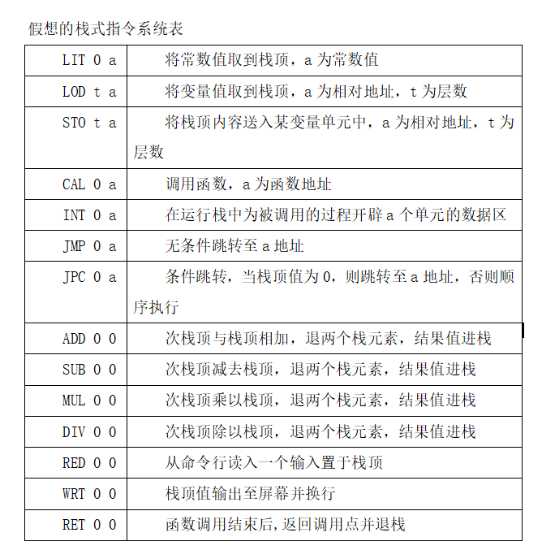
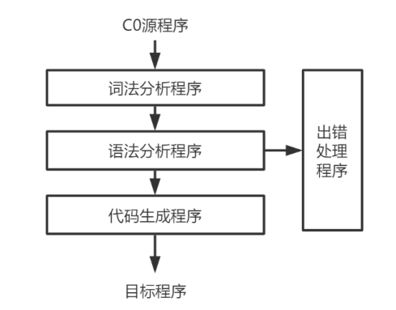
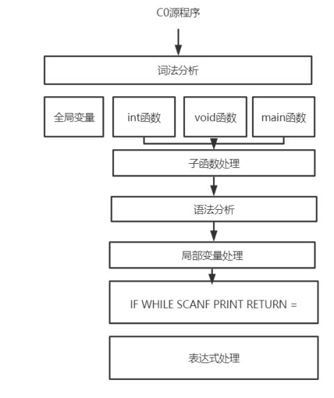

# My_C0_Compiler
一个使用Python实现C0编译器的项目，其中使用PLY库中的Lex和Yacc作为词法分析和语法分析的实现
  
## 题目
C0语言的语法结构定义如下：
<程序>->[<变量定义部分>] {<自定义函数定义部分>} <主函数>

<变量定义部分>-> int id {, id};
<自定义函数定义部分>-> ( int id | void id) '(' ')' <分程序>
<主函数>->void main'(' ')' <分程序>

<分程序>->'{' [<变量定义部分>] <语句序列> '}'  

<语句序列>-><语句> {<语句>}

<语句>-> <条件语句>｜<循环语句> | '{'<语句序列>'}' | <自定义函数调用语句> 
| <赋值语句> | <返回语句> | <读语句> | <写语句> | ;

<条件语句>->if '('<表达式>')' | <语句> [else <语句> ]
<循环语句>->while '(' <表达式>')' <语句>
<自定义函数调用语句>-><自定义函数调用>;
<赋值语句>->id = <表达式>;
<返回语句>->return ['(' <表达式> ')'] ;
<读语句>->scanf '(' id ')';
<写语句>->printf '(' [ <表达式>] ')';

<表达式>-> [+｜-] <项> { (+｜-) <项>} 
<项> -> <因子>｛(*｜/) <因子>｝
<因子> -> id｜'(' <表达式>')' | num | <自定义函数调用>

<自定义函数调用>->id '(' ')'
其中，id代表标识符，num代表整数，其含义及构成方式与C语言相一致；C0源程序中的变量需先定义后使用，其作用域与生存期与C语言相一致；自定义函数可超前使用（调用在前，定义在后）。
根据上面给定的C0文法及其说明和下列定义的假想栈式指令系统，按递归下降分析法设计并实现该C0语言的编译器，生成栈式目标代码；编写栈式指令系统的解释执行程序，输出目标代码的解释执行结果。

##分析与设计
开发环境：
本编译器使用Python环境进行开发

给出C0源程序地址。
C0编译器采用一遍扫描的方式，调用由Python实现的Lex词法自动分析器，分析C0源程序代码，一次性得到源程序代码内容所对应的全部分析结果（词的类型 词的值 词所在的行 词的位置）。
lex_rec.py lex内部代码
class LexToken(object):
    def __repr__(self):
        return f'LexToken({self.type},{self.value!r},{self.lineno},{self.lexpos}
将词法分析结果送入手工实现的语法分析程序，进行语法分析并得出C0目标代码。
调用解释程序解释C0目标代码。  

  
